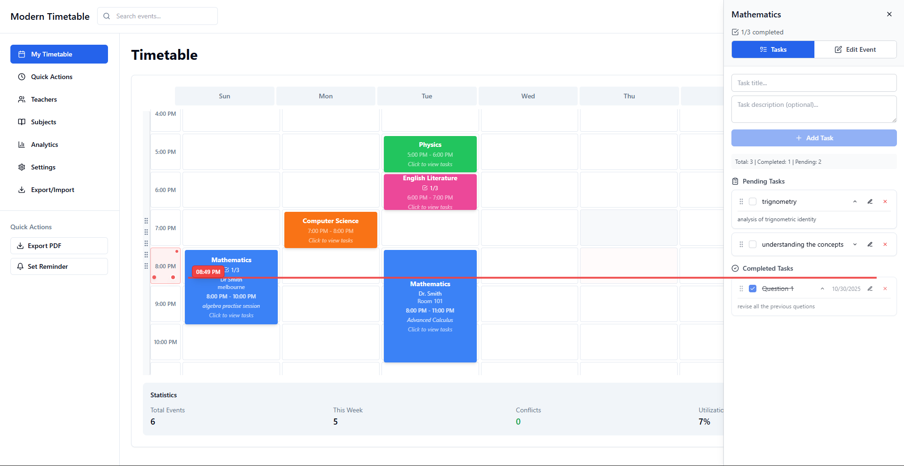
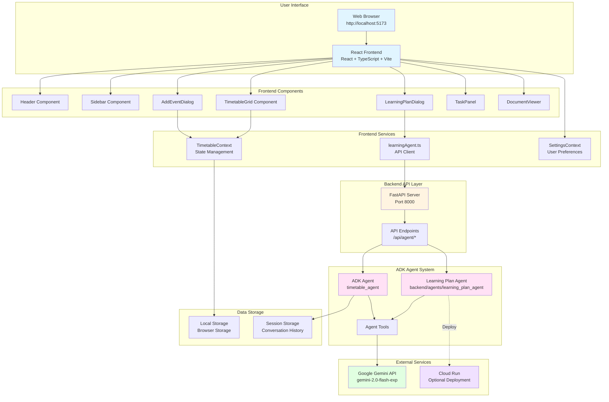
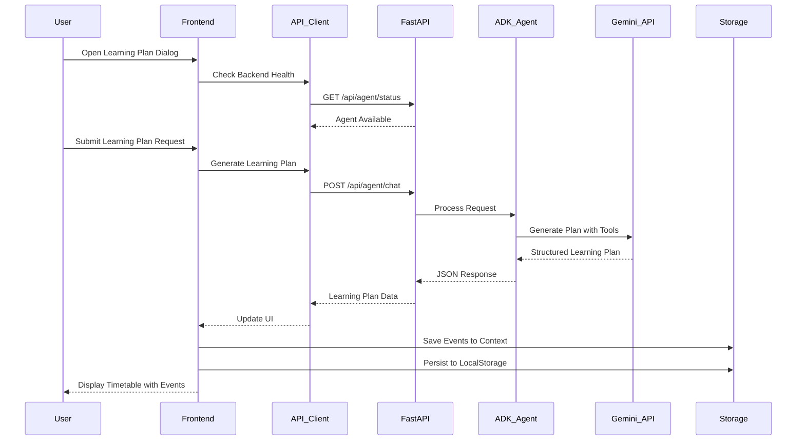
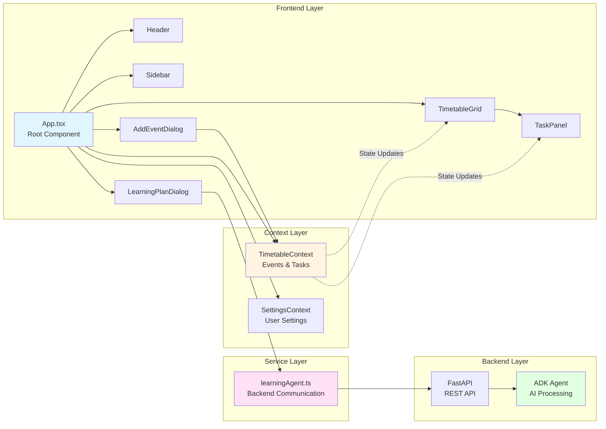

## Screenshots




# Timetable Website

A modern timetable management web application built with React, TypeScript, and Tailwind CSS.

## Features

- Interactive timetable grid
- Add, edit, and delete events
- AI-powered learning plan generator (Python backend)
- **AI-powered task content generation** - Generate detailed markdown content for individual tasks
- Task panel integration
- Export and import functionality
- Responsive design

## Installation

1. Clone the repository:
   ```bash
   git clone https://github.com/mdnadeemm/timetable-website.git
   cd timetable-website
   ```

2. Install frontend dependencies:
   ```bash
   npm install
   ```

3. Set up the Python backend (Required for AI features):
   ```bash
   cd backend
   ```

4. Create and activate a virtual environment:
   ```bash
   # Windows
   python -m venv venv
   venv\Scripts\activate

   # macOS/Linux
   python3 -m venv venv
   source venv/bin/activate
   ```

5. Install Python dependencies:
   ```bash
   pip install -r requirements.txt
   ```

6. Set up environment variables:
   Create a `.env` file in the `backend/agents/learning_plan_agent` directory:
   ```env
   GOOGLE_GENAI_USE_VERTEXAI=0
   GOOGLE_API_KEY=your_api_key
   ```
   
   To get a Google AI API key:
   - Visit https://aistudio.google.com/app/apikey
   - Create a new API key
   - Copy it to your `backend/agents/learning_plan_agent/.env` file

7. Start the backend server:
   Navigate to the agents directory and start the ADK API server:
   ```bash
   cd backend/agents
   adk api_server
   ```

8. In a new terminal, start the frontend development server:
   ```bash
   # From the project root directory
   npm run dev
   ```

**Important Notes:**
- The Python backend is **required** for AI-powered features (learning plan generation and task content generation)
- The API key should be placed in `backend/agents/learning_plan_agent/.env`, **not** in the root `.env` file
- The backend runs on `http://localhost:8000` by default

## Running Both Frontend and Backend

The application requires both servers to be running:

1. **Terminal 1** - Backend (ADK API Server):
   ```bash
   cd backend/agents
   adk api_server
   ```
   Wait for the message indicating the server is running on `http://localhost:8000`

2. **Terminal 2** - Frontend (React):
   ```bash
   npm run dev
   ```
   The frontend will start on `http://localhost:5173` (or the port shown in the terminal)

The frontend will automatically detect and use the Python backend if it's available. **AI features will not work without the backend running.**


## Deploying to Cloud Run

To deploy the learning plan agent to Google Cloud Run:

```bash
cd backend/agents
adk deploy cloud_run learning_plan_agent
```

This command will:
1. Package the agent
2. Build a container image
3. Deploy to Google Cloud Run
4. Provide you with the deployment URL

**Prerequisites:**
- Google Cloud SDK installed and configured
- Appropriate permissions for Cloud Run deployment
- Project billing enabled (if required)

**After deployment:**
- The agent will be accessible via the provided Cloud Run URL
- You can integrate this URL into your frontend application
- The agent will automatically scale based on traffic

## Architecture

### Full Application Diagram



### Application Flow Diagram



### Component Interaction Diagram



## Usage

Open your browser and navigate to `http://localhost:5173` (or the port shown in the terminal).

### Generate AI-Powered Learning Plans

1. **Open the Learning Plan Generator**
   - Click the "Generate Learning Plan" button in the application header

2. **Configure Your Learning Plan**
   - **Skill**: Enter the skill or subject you want to learn (e.g., "React Development", "Python Programming", "Data Science")
   - **Number of Weeks**: Specify the duration of your learning journey (e.g., 4, 8, 12 weeks)
   - **Hours per Week**: Set your available study time per week (e.g., 10, 15, 20 hours)
   - **Difficulty Level**: Choose your experience level (Beginner, Intermediate, Advanced)
   - **Focus Areas** (Optional): Specify particular topics or areas you want to emphasize

3. **Generate the Plan**
   - Click "Generate" and the AI will create a comprehensive learning plan
   - The AI generates:
     - **Weekly Structure**: Organized plan divided into your specified number of weeks
     - **Daily Events**: Learning sessions scheduled across weekdays (Monday-Friday) with specific time slots
     - **Event Details**: Each event includes title, description, teacher, location, and time
     - **Associated Tasks**: 2-5 practical tasks for each learning session to complete during or after the event

4. **View Your Timetable**
   - The generated plan appears as a visual weekly timetable
   - Events are color-coded for easy identification
   - Click any event to view details and associated tasks

### AI-Powered Task Content Generation

Each task in your timetable can be enhanced with detailed learning materials:

1. **Generate Task Content**
   - Click the **✨ Generate Content** button on any task
   - The AI analyzes the task within the context of your learning plan and generates detailed markdown content

2. **Generated Content Includes**
   - Task overview and learning objectives
   - Prerequisites and required knowledge
   - Context connecting to the overall learning plan and week objectives
   - Step-by-step instructions
   - Curated resources and references
   - Acceptance criteria (checklist format)
   - Deliverables specification
   - Optional extension activities for deeper learning

3. **Access Generated Content**
   - The markdown file is automatically attached to the task
   - Click the dropdown arrow on the task to view all attachments
   - Click on the markdown file to open and read the detailed content
   - All files are saved locally and persist across sessions

### Managing Your Timetable

- **Add Events Manually**: Create custom events outside the AI-generated plan
- **Edit Events**: Modify event details, times, and descriptions
- **Task Management**: Mark tasks as complete, reorder them via drag-and-drop
- **Attach Files**: Upload documents, PDFs, images, or links to tasks
- **Filter by Week**: Focus on specific weeks of your learning plan
- **Search**: Quickly find events and tasks
- **Export/Import**: Backup and share your timetable

**Note:** AI features (learning plan generation and task content generation) **require** the ADK backend agent to be running. Make sure you've set up the Python backend with the API key in `backend/agents/learning_plan_agent/.env` and started the server before using these features.

## Technologies Used

### Frontend
- React
- TypeScript
- Tailwind CSS
- Vite
- ESLint

### Backend (Required for AI Features)
- Python 3.8+
- FastAPI
- Google ADK (Agent Development Kit)
- Google Generative AI SDK
- Uvicorn

## Contributing

1. Fork the repository
2. Create a feature branch
3. Make your changes
4. Submit a pull request

## License

This project is licensed under the MIT License.