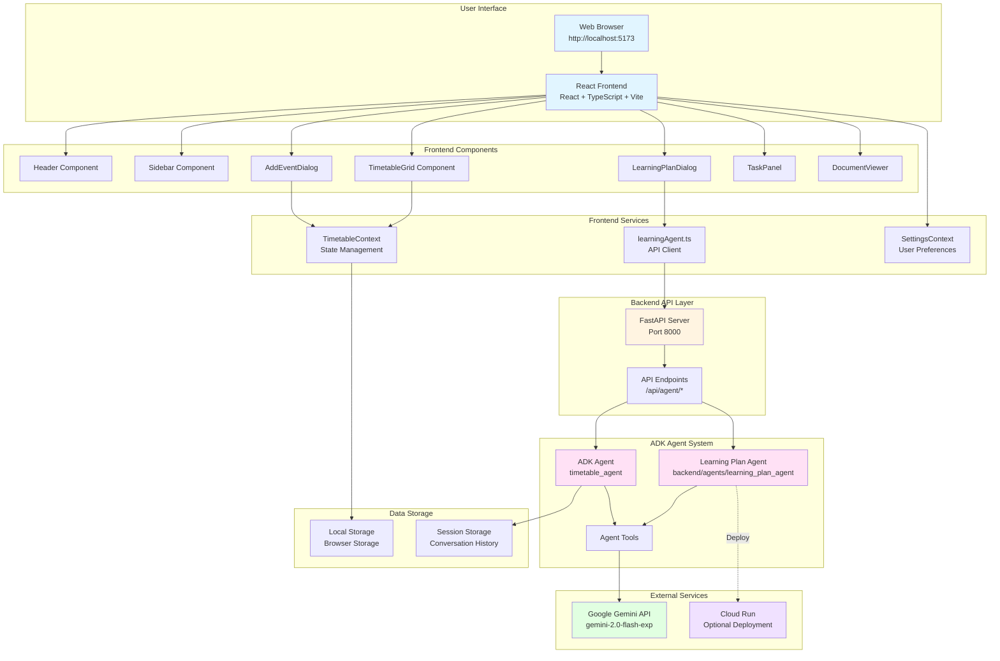
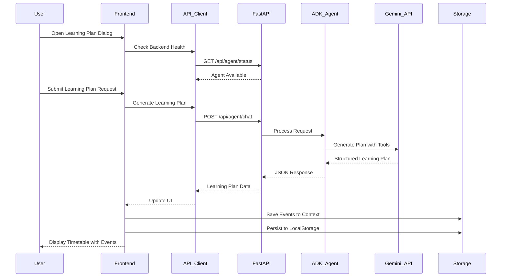
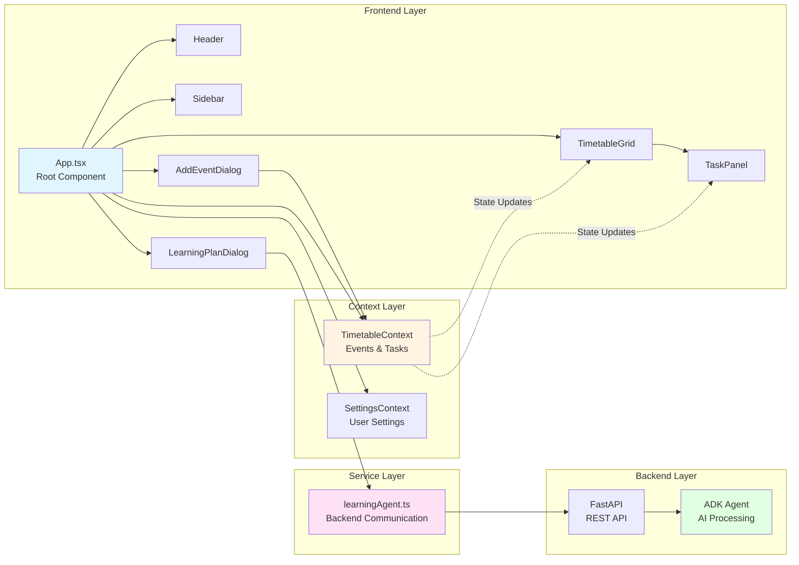

## Screenshots


# Timetable Website

A modern timetable management web application built with React, TypeScript, and Tailwind CSS.

## Features

- Interactive timetable grid
- Add, edit, and delete events
- AI-powered learning plan generator (Python backend)
- Task panel integration
- Export and import functionality
- Responsive design

## Installation

1. Clone the repository:
   ```bash
   git clone https://github.com/mdnadeemm/timetable-website.git
   cd timetable-website
   ```

2. Install dependencies:
   ```bash
   npm install
   ```

3. Set up environment variables:
   Create a `.env` file in the project root:
   ```env
   VITE_GOOGLE_AI_API_KEY=your_api_key_here
   ```
   
   To get a Google AI API key:
   - Visit https://aistudio.google.com/app/apikey
   - Create a new API key
   - Copy it to your `.env` file
   
   **Note**: All environment variables must be prefixed with `VITE_` to be exposed to the client.

4. Start the development server:
   ```bash
   npm run dev
   ```

## Python Backend Setup (Optional - for AI Learning Plans)

The learning plan feature can use either:
1. **Python Backend** (Recommended) - More secure, uses Google's official Python SDK
2. Direct browser API calls - Simpler but exposes API key

### Setting up Python Backend

1. Navigate to the backend directory:
   ```bash
   cd backend
   ```

2. Create and activate a virtual environment:
   ```bash
   # Windows
   python -m venv venv
   venv\Scripts\activate

   # macOS/Linux
   python3 -m venv venv
   source venv/bin/activate
   ```

3. Install dependencies:
   ```bash
   pip install -r requirements.txt
   ```

4. The `.env` file should already be configured (copied from the frontend setup)

5. Start the backend server:
   ```bash
   # Windows (PowerShell)
   .\start.ps1

   # macOS/Linux
   chmod +x start.sh
   ./start.sh

   # Or manually
   python main.py
   ```

6. Backend will run on `http://localhost:8000`
   - API Documentation: http://localhost:8000/docs
   - Health Check: http://localhost:8000/api/health

### Running Both Frontend and Backend

1. **Terminal 1** - Backend (Python):
   ```bash
   cd backend
   python main.py
   ```

2. **Terminal 2** - Frontend (React):
   ```bash
   npm run dev
   ```

The frontend will automatically detect and use the Python backend if it's available.

### Testing the Backend ADK Agent

Before deploying or using the agent, test it to ensure everything is working correctly:

```bash
cd backend
python test_adk_agent.py
```

This will test:
- Environment configuration
- Module imports
- Agent initialization
- All tool functions (learning plan, schedule, progress, resources)

The test suite will provide detailed output and indicate any issues that need to be resolved.

### Running ADK API Server

For local development and testing, you can run the ADK agent directly using the ADK CLI:

```bash
cd backend/agents
adk api_server
```

This will start the ADK API server locally, allowing you to interact with the `learning_plan_agent` directly through the ADK interface.

**Note:** Make sure you have the ADK CLI installed:
```bash
pip install google-adk[cli]
```

### Deploying to Cloud Run

To deploy the learning plan agent to Google Cloud Run:

```bash
cd backend/agents
adk deploy cloud_run learning_plan_agent
```

This command will:
1. Package the agent
2. Build a container image
3. Deploy to Google Cloud Run
4. Provide you with the deployment URL

**Prerequisites:**
- Google Cloud SDK installed and configured
- Appropriate permissions for Cloud Run deployment
- Project billing enabled (if required)

**After deployment:**
- The agent will be accessible via the provided Cloud Run URL
- You can integrate this URL into your frontend application
- The agent will automatically scale based on traffic

### Deployment Options Summary

| Option | Command | Use Case | Port |
|--------|---------|----------|------|
| **Test Agent** | `cd backend && python test_adk_agent.py` | Verify setup | N/A |
| **ADK API Server** | `cd backend/agents && adk api_server` | Local ADK development | 8000 (default) |
| **FastAPI Server** | `cd backend && python main.py` | Integrated backend | 8000 |
| **Cloud Run** | `cd backend/agents && adk deploy cloud_run learning_plan_agent` | Production deployment | Cloud-provided |

For more detailed information about the ADK agent implementation, see [backend/ADK_AGENT_README.md](backend/ADK_AGENT_README.md).

## Architecture

### Full Application Diagram



### Application Flow Diagram



### Component Interaction Diagram



## Usage

Open your browser and navigate to `http://localhost:5173` (or the port shown in the terminal).

## Technologies Used

### Frontend
- React
- TypeScript
- Tailwind CSS
- Vite
- ESLint

### Backend (Optional)
- Python 3.8+
- FastAPI
- Google ADK (Agent Development Kit)
- Google Generative AI SDK
- Uvicorn

## Contributing

1. Fork the repository
2. Create a feature branch
3. Make your changes
4. Submit a pull request

## License

This project is licensed under the MIT License.